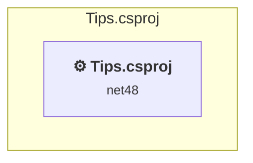

# Projects and dependencies analysis

This document provides a comprehensive overview of the projects and their dependencies in the context of upgrading to .NETCoreApp,Version=v8.0.

## Table of Contents

- [Executive Summary](#executive-Summary)
  - [Highlevel Metrics](#highlevel-metrics)
  - [Projects Compatibility](#projects-compatibility)
  - [Package Compatibility](#package-compatibility)
  - [API Compatibility](#api-compatibility)
- [Aggregate NuGet packages details](#aggregate-nuget-packages-details)
- [Top API Migration Challenges](#top-api-migration-challenges)
  - [Technologies and Features](#technologies-and-features)
  - [Most Frequent API Issues](#most-frequent-api-issues)
- [Projects Relationship Graph](#projects-relationship-graph)
- [Project Details](#project-details)

  - [Tips\Tips.csproj](#tipstipscsproj)

## Executive Summary

### Highlevel Metrics

| Metric | Count | Status |
| :--- | :---: | :--- |
| Total Projects | 1 | All require upgrade |
| Total NuGet Packages | 5 | 1 need upgrade |
| Total Code Files | 90 |  |
| Total Code Files with Incidents | 20 |  |
| Total Lines of Code | 5632 |  |
| Total Number of Issues | 324 |  |
| Estimated LOC to modify | 313+ | at least 5.6% of codebase |

### Projects Compatibility

| Project | Target Framework | Difficulty | Package Issues | API Issues | Est. LOC Impact | Description |
| :--- | :---: | :---: | :---: | :---: | :---: | :--- |
| [Tips\Tips.csproj](#tipstipscsproj) | net48 | 🔴 High | 5 | 313 | 313+ | Wap, Sdk Style = False |

### Package Compatibility

| Status | Count | Percentage |
| :--- | :---: | :---: |
| ✅ Compatible | 4 | 80.0% |
| ⚠️ Incompatible | 0 | 0.0% |
| 🔄 Upgrade Recommended | 1 | 20.0% |
| ***Total NuGet Packages*** | ***5*** | ***100%*** |

### API Compatibility

| Category | Count | Impact |
| :--- | :---: | :--- |
| 🔴 Binary Incompatible | 294 | High - Require code changes |
| 🟡 Source Incompatible | 19 | Medium - Needs re-compilation and potential conflicting API error fixing |
| 🔵 Behavioral change | 0 | Low - Behavioral changes that may require testing at runtime |
| ✅ Compatible | 6120 |  |
| ***Total APIs Analyzed*** | ***6433*** |  |

## Aggregate NuGet packages details

| Package | Current Version | Suggested Version | Projects | Description |
| :--- | :---: | :---: | :--- | :--- |
| EntityFramework | 6.5.1 | 6.5.2 | [Tips.csproj](#tipstipscsproj) | NuGet package upgrade is recommended |
| Microsoft.AspNet.Mvc | 5.2.9 |  | [Tips.csproj](#tipstipscsproj) | NuGet package functionality is included with framework reference |
| Microsoft.AspNet.Razor | 3.2.9 |  | [Tips.csproj](#tipstipscsproj) | NuGet package functionality is included with framework reference |
| Microsoft.AspNet.WebPages | 3.2.9 |  | [Tips.csproj](#tipstipscsproj) | NuGet package functionality is included with framework reference |
| Microsoft.Web.Infrastructure | 2.0.0 |  | [Tips.csproj](#tipstipscsproj) | NuGet package functionality is included with framework reference |

## Top API Migration Challenges

### Technologies and Features

| Technology | Issues | Percentage | Migration Path |
| :--- | :---: | :---: | :--- |
| ASP.NET Framework (System.Web) | 309 | 98.7% | Legacy ASP.NET Framework APIs for web applications (System.Web.*) that don't exist in ASP.NET Core due to architectural differences. ASP.NET Core represents a complete redesign of the web framework. Migrate to ASP.NET Core equivalents or consider System.Web.Adapters package for compatibility. |
| Legacy Configuration System | 2 | 0.6% | Legacy XML-based configuration system (app.config/web.config) that has been replaced by a more flexible configuration model in .NET Core. The old system was rigid and XML-based. Migrate to Microsoft.Extensions.Configuration with JSON/environment variables; use System.Configuration.ConfigurationManager NuGet package as interim bridge if needed. |

### Most Frequent API Issues

| API | Count | Percentage | Category |
| :--- | :---: | :---: | :--- |
| T:System.Web.Mvc.ActionResult | 32 | 10.2% | Binary Incompatible |
| T:System.Web.Mvc.ViewResult | 28 | 8.9% | Binary Incompatible |
| M:System.Web.Mvc.ValidateAntiForgeryTokenAttribute.#ctor | 17 | 5.4% | Binary Incompatible |
| T:System.Web.Mvc.ValidateAntiForgeryTokenAttribute | 17 | 5.4% | Binary Incompatible |
| M:System.Web.Mvc.HttpPostAttribute.#ctor | 17 | 5.4% | Binary Incompatible |
| T:System.Web.Mvc.HttpPostAttribute | 17 | 5.4% | Binary Incompatible |
| M:System.Web.Mvc.Controller.View(System.Object) | 11 | 3.5% | Binary Incompatible |
| P:System.Web.Mvc.ControllerBase.ViewBag | 11 | 3.5% | Binary Incompatible |
| T:System.Web.Mvc.RedirectToRouteResult | 10 | 3.2% | Binary Incompatible |
| M:System.Web.Mvc.Controller.View(System.String,System.Object) | 9 | 2.9% | Binary Incompatible |
| M:System.Web.Mvc.Controller.View | 8 | 2.6% | Binary Incompatible |
| M:System.Web.Mvc.Controller.RedirectToAction(System.String,System.Object) | 7 | 2.2% | Binary Incompatible |
| T:System.Web.Mvc.TempDataDictionary | 6 | 1.9% | Binary Incompatible |
| P:System.Web.Mvc.ControllerBase.TempData | 6 | 1.9% | Binary Incompatible |
| P:System.Web.Mvc.TempDataDictionary.Item(System.String) | 6 | 1.9% | Binary Incompatible |
| T:System.Web.Security.FormsAuthentication | 3 | 1.0% | Binary Incompatible |
| T:System.Web.Mvc.FileContentResult | 3 | 1.0% | Binary Incompatible |
| M:System.Web.Mvc.Controller.File(System.Byte[],System.String,System.String) | 3 | 1.0% | Binary Incompatible |
| T:System.Web.Mvc.UrlParameter | 3 | 1.0% | Binary Incompatible |
| T:System.Web.HttpServerUtilityBase | 2 | 0.6% | Source Incompatible |
| M:System.Web.Services.WebServiceBindingAttribute.#ctor | 2 | 0.6% | Binary Incompatible |
| T:System.Web.Services.WebServiceBindingAttribute | 2 | 0.6% | Binary Incompatible |
| M:System.Web.Services.WebServiceAttribute.#ctor | 2 | 0.6% | Binary Incompatible |
| T:System.Web.Services.WebServiceAttribute | 2 | 0.6% | Binary Incompatible |
| M:System.Web.Mvc.AuthorizeAttribute.#ctor | 2 | 0.6% | Binary Incompatible |
| T:System.Web.Mvc.AuthorizeAttribute | 2 | 0.6% | Binary Incompatible |
| M:System.Web.Mvc.Controller.#ctor | 2 | 0.6% | Binary Incompatible |
| T:System.Web.Mvc.Controller | 2 | 0.6% | Binary Incompatible |
| M:System.Web.Mvc.Controller.RedirectToAction(System.String,System.String) | 2 | 0.6% | Binary Incompatible |
| M:System.Web.Mvc.HttpGetAttribute.#ctor | 2 | 0.6% | Binary Incompatible |
| T:System.Web.Mvc.HttpGetAttribute | 2 | 0.6% | Binary Incompatible |
| T:System.Web.Mvc.HttpNotFoundResult | 2 | 0.6% | Binary Incompatible |
| M:System.Web.Mvc.Controller.HttpNotFound | 2 | 0.6% | Binary Incompatible |
| T:System.TimeZone | 2 | 0.6% | Source Incompatible |
| M:System.Web.Security.FormsAuthentication.SignOut | 2 | 0.6% | Binary Incompatible |
| T:System.Web.Mvc.UrlHelper | 2 | 0.6% | Binary Incompatible |
| P:System.Web.Mvc.Controller.Url | 2 | 0.6% | Binary Incompatible |
| T:System.Web.Routing.RouteCollection | 2 | 0.6% | Binary Incompatible |
| T:System.Web.Mvc.RouteCollectionExtensions | 2 | 0.6% | Binary Incompatible |
| M:System.Web.Mvc.AllowHtmlAttribute.#ctor | 1 | 0.3% | Binary Incompatible |
| T:System.Web.Mvc.AllowHtmlAttribute | 1 | 0.3% | Binary Incompatible |
| M:System.Web.HttpServerUtilityBase.MapPath(System.String) | 1 | 0.3% | Source Incompatible |
| M:System.Web.Script.Services.ScriptMethodAttribute.#ctor | 1 | 0.3% | Binary Incompatible |
| T:System.Web.Script.Services.ScriptMethodAttribute | 1 | 0.3% | Binary Incompatible |
| M:System.Web.Services.WebMethodAttribute.#ctor | 1 | 0.3% | Binary Incompatible |
| T:System.Web.Services.WebMethodAttribute | 1 | 0.3% | Binary Incompatible |
| M:System.Web.Services.WebService.#ctor | 1 | 0.3% | Binary Incompatible |
| T:System.Web.Services.WebService | 1 | 0.3% | Binary Incompatible |
| T:System.Web.HttpContext | 1 | 0.3% | Source Incompatible |
| T:System.Web.HttpResponse | 1 | 0.3% | Source Incompatible |

## Projects Relationship Graph

Legend:
📦 SDK-style project
⚙️ Classic project

## Project Details

### Tips\Tips.csproj

#### Project Info

- **Current Target Framework:** net48
- **Proposed Target Framework:** net8.0
- **SDK-style**: False
- **Project Kind:** Wap
- **Dependencies**: 0
- **Dependants**: 0
- **Number of Files**: 152
- **Number of Files with Incidents**: 20
- **Lines of Code**: 5632
- **Estimated LOC to modify**: 313+ (at least 5.6% of the project)

#### Dependency Graph

Legend:
📦 SDK-style project
⚙️ Classic project

### API Compatibility

| Category | Count | Impact |
| :--- | :---: | :--- |
| 🔴 Binary Incompatible | 294 | High - Require code changes |
| 🟡 Source Incompatible | 19 | Medium - Needs re-compilation and potential conflicting API error fixing |
| 🔵 Behavioral change | 0 | Low - Behavioral changes that may require testing at runtime |
| ✅ Compatible | 6120 |  |
| ***Total APIs Analyzed*** | ***6433*** |  |

#### Project Technologies and Features

| Technology | Issues | Percentage | Migration Path |
| :--- | :---: | :---: | :--- |
| Legacy Configuration System | 2 | 0.6% | Legacy XML-based configuration system (app.config/web.config) that has been replaced by a more flexible configuration model in .NET Core. The old system was rigid and XML-based. Migrate to Microsoft.Extensions.Configuration with JSON/environment variables; use System.Configuration.ConfigurationManager NuGet package as interim bridge if needed. |
| ASP.NET Framework (System.Web) | 309 | 98.7% | Legacy ASP.NET Framework APIs for web applications (System.Web.*) that don't exist in ASP.NET Core due to architectural differences. ASP.NET Core represents a complete redesign of the web framework. Migrate to ASP.NET Core equivalents or consider System.Web.Adapters package for compatibility. |

